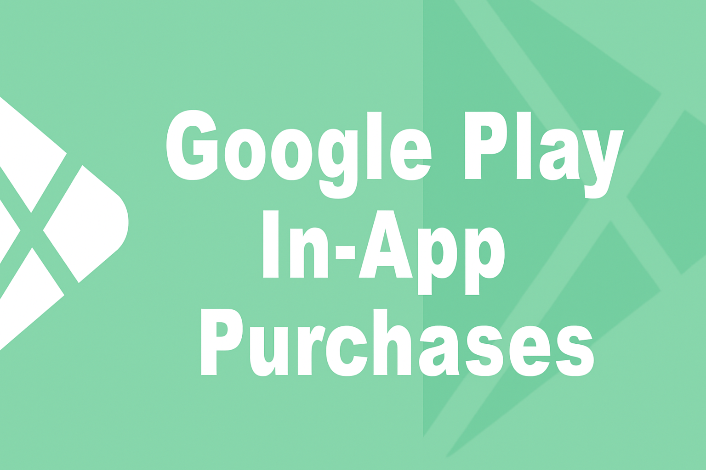
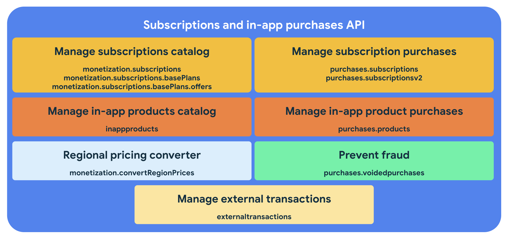

<p align="center">
<a href="https://imdhemy.com/laravel-iap-docs/docs/google-play-billing/intro"></a>
</p>

<p align="center">

<a href="https://packagist.org/packages/imdhemy/google-play-billing"></a>
<a href="https://packagist.org/packages/imdhemy/google-play-billing"></a>
<a href="https://packagist.org/packages/imdhemy/google-play-billing"></a>
<a href="https://github.com/imdhemy/google-play-billing/actions/workflows/ci.yaml"></a>
</p>

## PHP Google Play In-App Purchases

<p align='center'></p>

**Google Play Billing** for PHP provides a clean, developer-friendly to interact
with https://developers.google.com/android-publisher. This
package is ideal for applications that need validate purchases, manage subscriptions and interact with Google Play
Product Catalog.

### Features

* Simple integration with the Google Play Developer API
* Support for purchase and subscription validation
* Handles authentication using Google service accounts
* Lightweight, extensible, and framework-agnostic

## Installation

Use composer

```
composer require imdhemy/google-play-billing
```

## Getting Started

Refer to the documentation in the [docs](docs/README.md#php-google-play-in-app-purchase-google-play-billing) for setup
instructions, configuration, and usage examples.

## Requirements

* PHP 8.4 or higher
* Google Cloud project with access to the Android Publisher API
* A service account with appropriate permissions

## Contributing

- Feel free to check the [contributing guide](/CONTRIBUTING.md).
- Here is the developer guide to help you get started with the codebase: [Developer guide](/DEVELOPER_GUIDE.md).
- You still have questions? Drop them in
  the [discussions tab](https://github.com/imdhemy/google-play-billing/discussions).

## License

The App Store IAP is an open-sourced software licensed under the [MIT license](./LICENSE.md).
